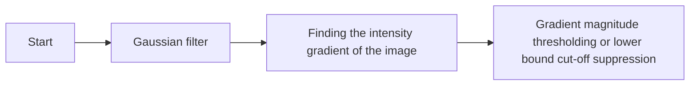

# 实验简介

是图像处理和计算机视觉中的基本问题，边缘检测的目的是标识数字图像中亮度变化明显的点。图像属性中的显著变化通常反映了属性的重要事件和变化。这些包括（i）深度上的不连续、（ii）表面方向不连续、（iii）物质属性变化和（iv）场景照明变化。 边缘检测是图像处理和计算机视觉中，尤其是特征检测中的一个研究领域。

本实验重点实现Canny算子。

# 实验目的

实现以下边缘检测算子：

sobel，prewitt，laplace，canny

对比观察效果。

# 算法模型

构建算子：

$x$方向的$sobel$:
$$
sobel_x =    
\left[
 \begin{matrix}
   -1 & 0 & 1 \\
   -2 & 0 & 2 \\
   -1 & 0 & 1
  \end{matrix}
  \right]
$$
$y$方向的$sobel$:
$$
sobel_y =    
\left[
 \begin{matrix}
   -1 & -2 & -1 \\
   0 & 0 & 0 \\
   -1 & 2 & 1
  \end{matrix}
  \right]
$$
$x$方向的$prewitt$:
$$
prewitt_x =    
\left[
 \begin{matrix}
   -1 & 0 & 1 \\
   -1 & 0 & 1 \\
   -1 & 0 & 1
  \end{matrix}
  \right]
$$
$y$方向的$prewitt$:
$$
prewitt_y =    
\left[
 \begin{matrix}
   -1 & -1 & -1 \\
   0 & 0 & 0 \\
   1 & 1 & 1
  \end{matrix}
  \right]
$$
$laplace$:
$$
laplace =    
\left[
 \begin{matrix}
   0 & 1 & 0 \\
   1 & -4 & 1 \\
   0 & 1 & 0
  \end{matrix}
  \right]
$$
$simpleLaplace$:
$$
laplace =    
\left[
 \begin{matrix}
   1 & 1 & 1 \\
   1 & -8 & 1 \\
   1 & 1 & 1
  \end{matrix}
  \right]
$$
以上算子对原图卷积即可。

$canny$算子：

Canny的目标是找到一个最优的边缘检测算法，最优边缘检测的含义是：

好的检测 - 算法能够尽可能多地标识出图像中的实际边缘。
好的定位 - 标识出的边缘要与实际图像中的实际边缘尽可能接近。
最小响应 - 图像中的边缘只能标识一次，并且可能存在的图像噪声不应标识为边缘。
为了满足这些要求Canny使用了变分法，这是一种寻找满足特定功能的函数的方法。最优检测使用四个指数函数项的和表示，但是它非常近似于高斯函数的一阶导数。

# 算法原理

主要介绍Canny算法原理：

### 降噪

任何边缘检测算法都不可能在未经处理的原始数据上很好地处理，所以第一步是对原始数据与高斯平滑模板作卷积，得到的图像与原始图像相比有些轻微的模糊（blurred）。这样，单独的一个像素噪声在经过高斯平滑的图像上变得几乎没有影响。

### 寻找图像中的亮度梯度

图像中的边缘可能会指向不同的方向，所以Canny算法使用4个mask检测水平、垂直以及对角线方向的边缘。原始图像与每个mask所作的卷积都存储起来。对于每个点我们都标识在这个点上的最大值以及生成的边缘的方向。这样我们就从原始图像生成了图像中每个点亮度梯度图以及亮度梯度的方向。

### 在图像中跟踪边缘

较高的亮度梯度比较有可能是边缘，但是没有一个确切的值来限定多大的亮度梯度是边缘多大又不是，所以Canny使用了滞后阈值。

滞后阈值需要两个阈值——高阈值与低阈值。假设图像中的重要边缘都是连续的曲线，这样我们就可以跟踪给定曲线中模糊的部分，并且避免将没有组成曲线的噪声像素当成边缘。所以我们从一个较大的阈值开始，这将标识出我们比较确信的真实边缘，使用前面导出的方向信息，我们从这些真正的边缘开始在图像中跟踪整个的边缘。在跟踪的时候，我们使用一个较小的阈值，这样就可以跟踪曲线的模糊部分直到我们回到起点。

一旦这个过程完成，我们就得到了一个二值图像，每点表示是否是一个边缘点。

一个获得亚像素精度边缘的改进实现是在梯度方向检测二阶方向导数的过零点

$$
{\displaystyle L_{x}^{2}\,L_{xx}+2\,L_{x}\,L_{y}\,L_{xy}+L_{y}^{2}\,L_{yy}=0,}
$$

它在梯度方向的三阶方向导数满足符号条件
$$
{\displaystyle L_{x}^{3}\,L_{xxx}+3\,L_{x}^{2}\,L_{y}\,L_{xxy}+3\,L_{x}\,L_{y}^{2}\,L_{xyy}+L_{y}^{3}\,L_{yyy}<0}
$$

其中${\displaystyle L_{x}}, {\displaystyle L_{y}} ... {\displaystyle L_{yyy}}$表示用高斯核平滑原始图像得到的尺度空间表示${\displaystyle L}$计算得到的偏导数。用这种方法得到的边缘片断是连续曲线，这样就不需要另外的边缘跟踪改进。滞后阈值也可以用于亚像素边缘检测。

# 算法框图



# 程序设计

```python
import cv2
import numpy as np
import copy
import math

prewitt_x = np.array(
    [
        [-1, 0, 1],
        [-1, 0, 1],
        [-1, 0, 1]
    ]
)

prewitt_y = prewitt_x.T

sobel_x = np.array(
    [
        [-1, 0, 1],
        [-2, 0, 2],
        [-1, 0, 1]
    ]
)

sobel_y = sobel_x.T

laplace = np.array(
    [
        [0, 1, 0],
        [1, -4, 1],
        [0, 1, 0]
    ]
)

simpleLaplace = np.array(
    [
        [1, 1, 1],
        [1, -8, 1],
        [1, 1, 1]
    ]
)


def averageGray(rgb):
    return (np.dot(rgb[..., :3], [1, 1, 1])/3)


def averageGrayWithWeighted(rgb):
    return np.dot(rgb[..., :3], [0.299, 0.587, 0.114])


def convolution(sourceImage, operator, size=3):
    image = copy.deepcopy(sourceImage)
    imageWidth = image.shape[0]
    imageHeight = image.shape[1]
    newImage = np.zeros([imageWidth - size, imageHeight - size])
    for width in range(imageWidth - size):
        for height in range(imageHeight - size):
            newImage[width, height] = np.sum(
                sourceImage[width:width + size, height:height + size] * operator)
    return newImage.astype(np.uint8)


def getGaussianMarix(size=3, padding=1):
    sigma = size / 3.0
    gaussian = np.zeros([size, size])
    sum = 0
    for x in range(size):
        for y in range(size):
            gaussian[x, y] = math.exp(-1/2 * (np.square(x-padding)/np.square(sigma) + (
                np.square(y-padding)/np.square(sigma)))) / (2*math.pi*sigma*sigma)
            sum = sum + gaussian[x, y]
    gaussian = gaussian / sum
    return gaussian


def cannyKernel(sourceImage):
    image = copy.deepcopy(sourceImage)
    imageWidth, imageHeight = image.shape
    imageDX = np.zeros([imageWidth - 1, imageHeight - 1])
    imageDY = np.zeros([imageWidth - 1, imageHeight - 1])
    imageD = np.zeros([imageWidth - 1, imageHeight - 1])
    image = image.astype(np.float64)
    for w in range(imageWidth - 1):
        for h in range(imageHeight - 1):
            imageDX[w, h] = (image[w, h + 1] - image[w, h] +
                             image[w + 1, h + 1] - image[w + 1, h]) / 2
            imageDY[w, h] = (image[w + 1, h] - image[w, h] +
                             image[w + 1, h] - image[w + 1, h + 1]) / 2
            imageD[w, h] = np.sqrt(
                np.square(imageDX[w, h]) + np.square(imageDY[w, h]))
    newImage = copy.deepcopy(imageD)
    nImageWidth, nImageHeight = imageD.shape
    newImage[0, :] = newImage[:, 0] = newImage[nImageWidth -
                                               1, :] = newImage[:, nImageHeight-1] = 0
    for w in range(1, nImageWidth - 1):
        for h in range(1, nImageHeight - 1):
            if (imageD[w, h] == 0).all():
                newImage[w, h] = 0
            else:
                gradX = imageDX[w, h]
                gradY = imageDY[w, h]
                grad = imageD[w, h]
                if(np.abs(gradX) > np.abs(gradY)).all():
                    weight = np.abs(gradY) / np.abs(gradX)
                    grad2 = imageD[w, h - 1]
                    grad4 = imageD[w, h + 1]
                    if (gradX * gradY > 0).all():
                        grad1 = imageD[w + 1, h - 1]
                        grad3 = imageD[w - 1, h + 1]
                    else:
                        grad1 = imageD[w - 1, h - 1]
                        grad3 = imageD[w + 1, h + 1]
                else:
                    weight = np.abs(gradX) / np.abs(gradY)
                    grad2 = imageD[w - 1, h]
                    grad4 = imageD[w + 1, h]
                    if (gradX * gradY > 0).all():
                        grad1 = imageD[w - 1, h - 1]
                        grad3 = imageD[w + 1, h + 1]
                    else:
                        grad1 = imageD[w - 1, h + 1]
                        grad3 = imageD[w + 1, h - 1]
                gradTmp1 = weight * grad1 + (1 - weight) * grad2
                gradTmp2 = weight * grad3 + (1 - weight) * grad4
                if (grad >= gradTmp1).all() and (grad >= gradTmp2).all():
                    newImage[w, h] = grad
                else:
                    newImage[w, h] = 0
    return newImage.astype(np.uint8)


def cannyFinal(sourceImage):
    image = copy.deepcopy(sourceImage)
    imageWidth, imageHeight = image.shape
    num1 = 0.15 * sourceImage.max()
    num2 = 0.7 * sourceImage.max()
    for w in range(1, imageWidth - 1):
        for h in range(1, imageHeight - 1):
            if (sourceImage[w, h] < num1).all():
                image[w, h] = 0
            elif (sourceImage[w, h] > num2).all():
                image[w, h] = 255
            elif ((sourceImage[w - 1, h - 1:h + 1] < num1).any() or (sourceImage[w + 1, h - 1:h + 1]).any() or (sourceImage[w, [h - 1, h + 1]] < num2).any()):
                image[w, h] = 255
    return image.astype(np.uint8)


def main():
    path = 'H:\\Learning\DIP\\EdgeDetection\\test\\in2.jpg'
    outpath = 'H:\\Learning\DIP\\EdgeDetection\\test\\canny2.jpg'
    img = cv2.imread(path)
    # cv2.imwrite(outpath, cannyFinal(cannyKernel(averageGray(img))))
    cv2.imwrite(outpath, cannyFinal(cannyKernel(
        convolution(averageGray(img), getGaussianMarix()))))
    # cv2.imwrite(outpath, convolution(averageGray(img), getGaussianMarix()))


if __name__ == '__main__':
    main()

```

# 实验分析

原图：


sobel_y：


sobel_x:


prewitt_y


prewitt_x


simpleLaplace


laplace


canny


可见，canny在本实验中所有的算子中表现最佳。

此外，canny还可通过修改上下阀值来根据需求进行边缘检测：

例如：


降低低阀值的值：


