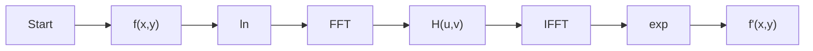

# 实验简介

同态变换：将非线性组合信号通过某种变换，使其变成线性组合信号，从而可以更方便的用线性操作对信号进行处理。

同态滤波：将原本的信号经由非线性映射，转换到可以使用线性滤波器的不同域，做完运算后再映射回原始域。同态的性质就是保持相关的属性不变，而同态滤波的好处是将原本复杂的运算转为效能相同但相对简单的运算。

# 实验目的

同态滤波利用去除乘性噪声，可以同时增加对比度以及标准化亮度，借此达到图像增强的目的。

# 算法模型

一副图像可以表示为其照度(illumination)分量和反射(reflectance)分量的乘积，虽然在时域上这两者是不可分离的，但是经由傅立叶转换两者在频域中可以线性分离。由于照度可视为环境中的照明，相对变化很小，可以看作是图像的低频成分；而反射率相对变化较大，则可视为高频成分。通过分别处理照度和反射率对像元灰度值的影响，通常是借由高通滤波器(high-pass filter)，让图像的照明更加均匀，达到增强阴影区细节特征的目的。

# 算法原理

对于一副图像，可表示为照射分量和反射分量的乘积，即


其中，$m$为图像，$i$为照度分量，$r$为反射分量。

为了在频域中使用高通滤波器，我们必须进行傅立叶转换，但由于上式是一个乘积式，不能直接对照度和反射的频率分量进行操作，因此对上式取对数


然后再对上式两边做傅立叶转换，


并将定义为

接下来对图像进行高通滤波，如此可以使图像的照明更均匀，高频分量增加且低频分量减少


其中，$N$是频域中滤波后的图像，$H$是高通滤波器。

为了将图像从频域转回时域，我们对$N$做傅立叶逆转换


最后，对$n$使用指数函数来复原我们一开始取的自然对数


其中$m'$为做完同态滤波的新图像。

# 算法框图



# 程序设计

依据算法框图进行设计即可：

本次设计为H提供了Gaussian（默认）和Butterworth，具体代码如下：

```python
import cv2
import numpy as np


def Butterworth(sp, args):
    P = sp[0] / 2
    Q = sp[1] / 2
    U, V = np.meshgrid(range(sp[0]), range(
        sp[1]), sparse=False, indexing='ij')
    Duv = (((U-P)**2+(V-Q)**2)).astype(float)
    H = 1/(1+(Duv/args[0]**2)**args[1])
    return 1-H


def Gaussian(sp, args):
    P = sp[0] / 2
    Q = sp[1] / 2
    U, V = np.meshgrid(range(sp[0]), range(
        sp[1]), sparse=False, indexing='ij')
    Duv = (((U-P)**2+(V-Q)**2)).astype(float)
    H = np.exp((-Duv/(2*args[0]**2)))
    return 1-H


def applyFilter(I, H, a, b):
    H = np.fft.fftshift(H)
    return (a+b*H)*I


def homomorphicFilt(img, args, a, b, type='Gaussian', ):
    imgLog = np.log1p(np.array(img, dtype="float"))
    imgfft = np.fft.fft2(imgLog)
    if type == 'Butterworth':
        H = Butterworth(imgfft.shape, args)
    elif type == 'Gaussian':
        H = Gaussian(imgfft.shape, args)
    else:
        raise(Exception(f'undefined type {type}'))
    imgfftTrans = applyFilter(imgfft, H, a, b)
    imgifft = np.fft.ifft2(imgfftTrans)
    img = np.exp(np.real(imgifft)) - 1
    return np.uint8(img)


def main():
    path = 'H:\\Learning\DIP\\test\\in2.jpg'
    outpath = 'H:\\Learning\DIP\\test\\out2.jpg'

    img = cv2.imread(path)
    a = 0.90
    b = 1.5
    sig = [350, 10]
    type = 'Gaussian'
    b = homomorphicFilt(img[:, :, 0], sig, a, b, type)
    g = homomorphicFilt(img[:, :, 1], sig, a, b, type)
    r = homomorphicFilt(img[:, :, 2], sig, a, b, type)
    res = np.zeros(img.shape)
    for i in range(img.shape[0]):
        for j in range(img.shape[1]):
            res[i][j][0] = b[i][j]
            res[i][j][1] = g[i][j]
            res[i][j][2] = r[i][j]
    cv2.imwrite(outpath, res)


if __name__ == '__main__':
    main()

```


# 实验分析

效果图：

<center class="half">
    
    
</center>

<center class="half">
    
    
</center>

可见通过同态滤波操作后，图片确实获得了一定的增强效果。


